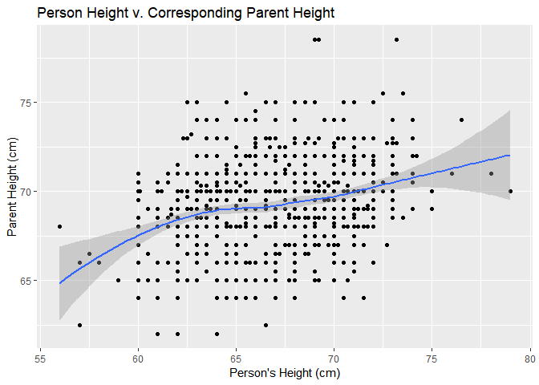
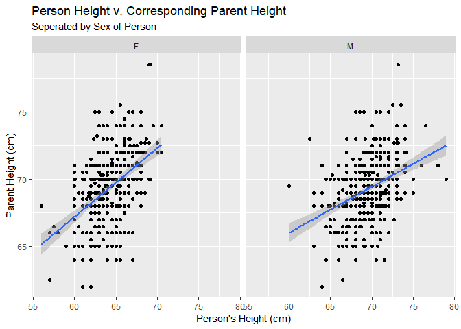
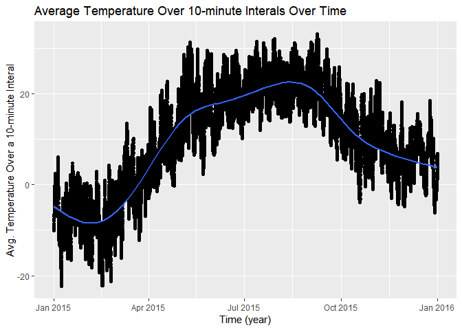
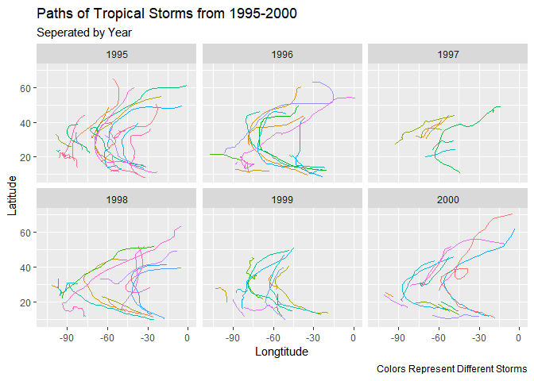
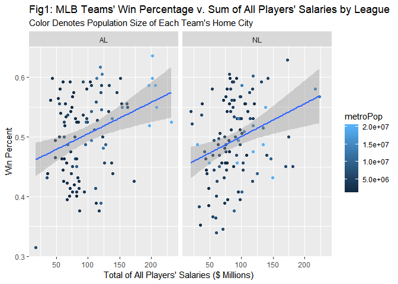

Homework 1
================
Noam Benkler
Due by 1:50 am, Wed. 1/16

To Do: Complete before Wednesday's class (1/16)
-----------------------------------------------

Use full sentences to answer the questions below if you are asked for an *answer* or *explanation*. You should be able to complete questions with a little review of intro stats R commands.

Push your knitted homework assignment (.Rmd and .md files) to GitHub by the given deadline. Also let me know:

**Who you worked with:**

### Problem 1

Textbook exercise 2.2. Here is the [referenced NYT website](http://www.nytimes.com/2012/04/15/sunday-review/coming-soon-taxmageddon.html?_r=0), the two graphs are in the links at the bottom of the article. Here are the links in case you can't view the article (I had to use an incognito window in Chrome to see the article):

-   [Whose Tax Rates Rose or Fell](https://archive.nytimes.com/www.nytimes.com/imagepages/2012/04/13/opinion/sunday/0415web-leonhardt.html)
-   [Who Gains the Most from Tax Breaks](https://archive.nytimes.com/www.nytimes.com/imagepages/2012/04/13/opinion/sunday/0415web-leonhardt2.html)

-   Carefully answer questions 1-3 for these two graphs. You can refer to them as "graph 1" (Whose Tax rates rose or fell) and "graph 2" (Who gains the most from tax breaks) in your answers.
-   Question 2 asks about variable dimension vs. data dimension. There is *one* graph that displays info about four variables but only three variables are connected to visual cues in the picture (the fourth variable is displayed as text but with no visual cue). Determine which graph this is, of the two, describes the variables that are and aren't visualized in the graph.

#### 1)

Graph 1 conveys largly conveys a drop in the average tax rate for individuals in and above the top 10% income bracket in the United States, an increase in the average tax rate of the middle 20% to top 20% income brackets, and a drop in average tax rate of the fourth and bottom 20% income bracket. Graph 1 also shows a significant increase in real pre-tax income of the Top 10% and up between 1960 and 2004. Graph 2 conveys that the top 20% of taxpayers beniffited the most from 4 of the 5 largest kinds of tax breaks in 2011, including exclusions, itemized deductions, dividends, and miscillanious provisions. The only tax break that graph 2 shows benefiting the bottom 80% of taxpayers more than the top 20% is refundable credits, which in total represents under a quarter of what exclusions cost the treasury. Together both graph 1 and graph 2 tell the story that the system of taxation in the United States strongly favors the top 10-20% of taxpayers.

#### 2)

The scales of graph 1 are appropriate and consistent. However, while the data labeling is present and clear upon inspection, it could be made clearer. Graph one has two visualized variables and two displayed with text. The visualized variables are segment of income distribution (color) and average tax rate (distance from x axis \[height\]). The two written variables are year (denoted as tics on the x axis) and change in real, pre-tax income (written on the side of 2004 average tax rate). Graph 2 is very clearly presented, the scales are appropriate, consistent, and clearely labelled. Graph 2 is the graph that displays info on four variables, only three of which are connected to visual cues in the picture. The variables that are visualized in the graph are income groups (color), total $ cost to the U.S. treasury (width of bars), and percent of benifit gained by different income groups (relative height of stacked bars). The variable not visualized but displayed as text is the type of tax break provided by the U.S. government (Exclusions, Itemized deductions, Refundable credits, Dividends, Misc. provisions).

#### 3)

Nothing is particularly misleading on this graph, it's just that it feels cluttered. There is a great deal of information crammed into a small space and it can distract from the central message of the graphs.

### Problem 2

Textbook exercise 2.5. Here is a [link to the website containing links to the collection](http://mdsr-book.github.io/exercises.html).

#### 1)

The graphic I chose shows UK government spending. It shows that the largest areas of government spending are the department of work & pensions, and the department of health, with the department of education trailing at third.

#### 2)

The graphic I chose relies on the area of different bubbles as a scale to describe levels of spending. The data map also uses color as qualitative scale to seperate different targets for government spending and different subsections of those targets.

#### 3)

Though if one takes time to work through the graphic it is easy to understand, the first impression of the figure is dissorienting and chaotic. Though not directly misleading the figures are hard to track and require a lot of breaking down spending by individual bubbles. A better way to represent government spending may have been with several seperate plots, one which showed a bar chart of percent of government spending dedicated to each of the broader targets, and several other faceted plots breaking down percent of government spending each subplot took up, faceted by the larger target.

### Problem 3

Textbook exercise 3.1. The data are stored in the `mosaicData` package, so you may need to install this package (not in your .Rmd file!) before loading it. Once the package is loaded, the data set `Galton` will be available to use.

``` r
library(mosaicData)
```

    ## Warning: package 'mosaicData' was built under R version 3.5.2

``` r
head(Galton)
```

    ##   family father mother sex height nkids
    ## 1      1   78.5   67.0   M   73.2     4
    ## 2      1   78.5   67.0   F   69.2     4
    ## 3      1   78.5   67.0   F   69.0     4
    ## 4      1   78.5   67.0   F   69.0     4
    ## 5      2   75.5   66.5   M   73.5     4
    ## 6      2   75.5   66.5   M   72.5     4

#### 1)

``` r
library(tidyverse)
```

    ## -- Attaching packages --------------------------------------------------- tidyverse 1.2.1 --

    ## v ggplot2 3.1.0     v purrr   0.2.5
    ## v tibble  1.4.2     v dplyr   0.7.8
    ## v tidyr   0.8.2     v stringr 1.3.1
    ## v readr   1.2.1     v forcats 0.3.0

    ## -- Conflicts ------------------------------------------------------ tidyverse_conflicts() --
    ## x dplyr::filter() masks stats::filter()
    ## x dplyr::lag()    masks stats::lag()

``` r
ggplot(data = Galton,  aes(x=height, y=father)) +
  geom_point() + geom_smooth(mapping = aes(x=height, y=father)) +
  labs(
    title = "Person Height v. Corresponding Parent Height",
    x = "Person's Height (cm)",
    y = "Parent Height (cm)"
  )
```

    ## `geom_smooth()` using method = 'loess' and formula 'y ~ x'



#### 2)

``` r
ggplot(data = Galton,  aes(x=height, y=father)) +
  geom_point() +
  facet_wrap(~sex) +
  labs(
    title = "Person Height v. Corresponding Parent Height",
    subtitle = "Seperated by Sex of Person",
    x = "Person's Height (cm)",
    y = "Parent Height (cm)"
  )
```


#### 3)

``` r
ggplot(data = Galton,  aes(x=height, y=father)) +
  geom_point() + geom_smooth(mapping = aes(x=height, y=father), method = lm) +
  facet_wrap(~sex) +
  labs(
    title = "Person Height v. Corresponding Parent Height",
    subtitle = "Seperated by Sex of Person",
    x = "Person's Height (cm)",
    y = "Parent Height (cm)"
  )
```



### Problem 4

Textbook exercise 3.8.

``` r
library(macleish)
```

    ## Warning: package 'macleish' was built under R version 3.5.2

    ## Loading required package: etl

    ## Warning: package 'etl' was built under R version 3.5.2

``` r
head(whately_2015)
```

    ## # A tibble: 6 x 8
    ##   when                temperature wind_speed wind_dir rel_humidity pressure
    ##   <dttm>                    <dbl>      <dbl>    <dbl>        <dbl>    <int>
    ## 1 2015-01-01 00:00:00       -9.32       1.40     225.         54.6      985
    ## 2 2015-01-01 00:10:00       -9.46       1.51     248.         55.4      985
    ## 3 2015-01-01 00:20:00       -9.44       1.62     258.         56.2      985
    ## 4 2015-01-01 00:30:00       -9.3        1.14     244.         56.4      985
    ## 5 2015-01-01 00:40:00       -9.32       1.22     238.         56.9      984
    ## 6 2015-01-01 00:50:00       -9.34       1.09     242.         57.2      984
    ## # ... with 2 more variables: solar_radiation <dbl>, rainfall <int>

``` r
ggplot(data = whately_2015,  aes(x=when, y=temperature)) +
  geom_point() + geom_smooth(mapping = aes(x=when, y=temperature)) +
  labs(
    title = "Average Temperature Over 10-minute Interals Over Time",
    x = "Time (year)",
    y = "Avg. Temperature Over a 10-minute Interal"
  )
```

    ## `geom_smooth()` using method = 'gam' and formula 'y ~ s(x, bs = "cs")'



### Problem 5

Textbook exercises 3.10. The data for the problem is the data frame `storms` in the `nasaweather` package.

-   Use `lat` (y-axis) and `long` (x-axis) to plot the path of the storms and add `coord_quickmap()` to get a decent aspect ratio between the two coordinates (so you can accurately judge distance traveled).
-   To exclude the legend of storm names/colors you can add `scale_color_discrete(guide="none")`.

``` r
library(nasaweather)
```

    ## Warning: package 'nasaweather' was built under R version 3.5.2

    ## 
    ## Attaching package: 'nasaweather'

    ## The following object is masked from 'package:dplyr':
    ## 
    ##     storms

``` r
head(storms)
```

    ## # A tibble: 6 x 11
    ##   name    year month   day  hour   lat  long pressure  wind type   seasday
    ##   <chr>  <int> <int> <int> <int> <dbl> <dbl>    <int> <int> <chr>    <int>
    ## 1 Allis~  1995     6     3     0  17.4 -84.3     1005    30 Tropi~       3
    ## 2 Allis~  1995     6     3     6  18.3 -84.9     1004    30 Tropi~       3
    ## 3 Allis~  1995     6     3    12  19.3 -85.7     1003    35 Tropi~       3
    ## 4 Allis~  1995     6     3    18  20.6 -85.8     1001    40 Tropi~       3
    ## 5 Allis~  1995     6     4     0  22   -86        997    50 Tropi~       4
    ## 6 Allis~  1995     6     4     6  23.3 -86.3      995    60 Tropi~       4

``` r
ggplot(data = storms,  aes(x=long, y=lat, color = name)) + coord_quickmap() + scale_color_discrete(guide = "none") +
  geom_path() +
  facet_wrap(~year) +
  labs(
    title = "Paths of Tropical Storms from 1995-2000",
    subtitle = "Seperated by Year",
    caption = "Colors Represent Different Storms",
    x = "Longtitude",
    y = "Latitude"
  )
```



### Problem 6

Consider the `MLB_teams` data set that is in the `mdsr` package (see exercise 3.5). (Install `mdsr` if needed, then load the package to get the data set.)

Use this data set to create a graph with at least 4 variables present. Describe the story you are attempting to display.

#### 1)

With this figure I am attempting to display the correlation between different MLB teams' win percentages and how much their players get paid in each of the two MLB leagues. These graphs include a color scale for the population of each teams' home city in order to test whether population of home city has any effect on win percentage.

``` r
library(mdsr)
```

    ## Warning: package 'mdsr' was built under R version 3.5.2

    ## Warning: package 'mosaic' was built under R version 3.5.2

    ## Loading required package: lattice

    ## Loading required package: ggformula

    ## Loading required package: ggstance

    ## 
    ## Attaching package: 'ggstance'

    ## The following objects are masked from 'package:ggplot2':
    ## 
    ##     geom_errorbarh, GeomErrorbarh

    ## 
    ## New to ggformula?  Try the tutorials: 
    ##  learnr::run_tutorial("introduction", package = "ggformula")
    ##  learnr::run_tutorial("refining", package = "ggformula")

    ## Loading required package: Matrix

    ## 
    ## Attaching package: 'Matrix'

    ## The following object is masked from 'package:tidyr':
    ## 
    ##     expand

    ## 
    ## The 'mosaic' package masks several functions from core packages in order to add 
    ## additional features.  The original behavior of these functions should not be affected by this.
    ## 
    ## Note: If you use the Matrix package, be sure to load it BEFORE loading mosaic.

    ## 
    ## In accordance with CRAN policy, the 'mdsr' package 
    ##            no longer attaches
    ## the 'tidyverse' package automatically.
    ## You may need to 'library(tidyverse)' in order to 
    ##            use certain functions.

``` r
head(MLB_teams)
```

    ## # A tibble: 6 x 11
    ##   yearID teamID lgID      W     L  WPct attendance normAttend payroll
    ##    <int> <chr>  <fct> <int> <int> <dbl>      <int>      <dbl>   <int>
    ## 1   2008 ARI    NL       82    80 0.506    2509924      0.584  6.62e7
    ## 2   2008 ATL    NL       72    90 0.444    2532834      0.589  1.02e8
    ## 3   2008 BAL    AL       68    93 0.422    1950075      0.454  6.72e7
    ## 4   2008 BOS    AL       95    67 0.586    3048250      0.709  1.33e8
    ## 5   2008 CHA    AL       89    74 0.546    2500648      0.582  1.21e8
    ## 6   2008 CHN    NL       97    64 0.602    3300200      0.768  1.18e8
    ## # ... with 2 more variables: metroPop <dbl>, name <chr>

``` r
ggplot(data = MLB_teams,  aes(x=payroll/1000000, y=WPct, color = metroPop)) + 
  geom_point() + geom_smooth(method = lm)+ facet_wrap(~lgID) +
  labs(
    title = "Fig1: MLB Teams' Win Percentage v. Sum of All Players' Salaries by League",
    subtitle = "Color Denotes Population Size of Each Team's Home City",
    x = "Total of All Players' Salaries ($ Millions) ",
    y = "Win Percent")
```


