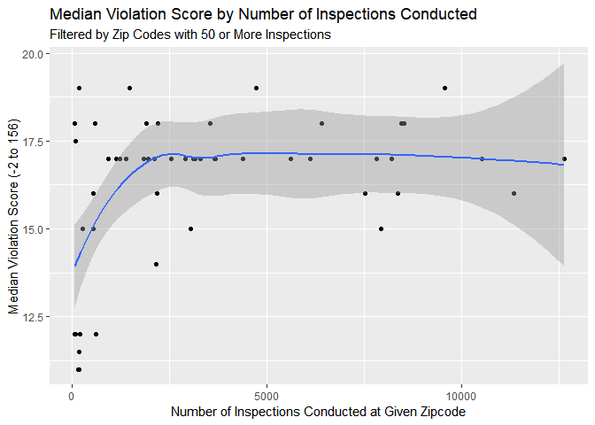
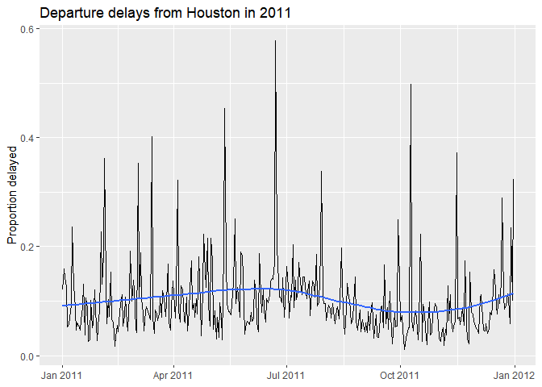
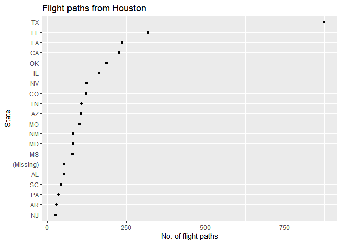
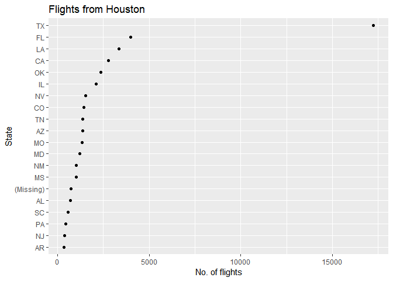

Homework 3
================
Noam Benkler
Due by 1:50 pm, Fri. 2/1

Push your knitted homework assignment (.Rmd and .md files) to GitHub by the given deadline.

Also let me know:

**Who you worked with:**

### Problem 1: explain command (no R needed)

Consider the data set shown in the table below. Each row represents a `class`: `S` denotes a statistics class and `C` denotes a CS class. The variable `m` counts the number of mac users in the class and `w` counts the number of windows users.

| class | m   | w   |
|-------|-----|-----|
| C     | 10  | 4   |
| C     | 3   | 1   |
| C     | 7   | 3   |
| S     | 2   | 7   |
| S     | 7   | 10  |

What data set will be produced by the following commands? Describe the data set in words and show what it looks like using an R Markdown table (like the one used above) to display the new data set. Assume the original data set is named `mydata`.

**a.** This code will produce a table with three rows displaying only the information about the computer science classes and two columns, exclusivly m and w with no class column.

``` r
mydata %>% 
  filter(class == "C") %>%
  select(w, m)
```

| w   | m   |
|-----|-----|
| 4   | 10  |
| 1   | 3   |
| 3   | 7   |

**b.** This code will create a table of mydata with a new column called ratioW which denotes the ratio of windows users in each class.

``` r
mydata %>% 
  mutate(ratioW = w / sum(w))
```

| class | m   | w   | ratioW |
|-------|-----|-----|--------|
| C     | 10  | 4   | 0.16   |
| C     | 3   | 1   | 0.04   |
| C     | 7   | 3   | 0.12   |
| S     | 2   | 7   | 0.28   |
| S     | 7   | 10  | 0.4    |

**c.** This code will output the same table as above (with variables grouped and ordered by class alphabetically) except ratioW will have a different value. ratioW will show the the ratio of windows users in a single class to total windows users in each type of class

``` r
mydata %>% 
  group_by(class) %>%
  mutate(ratioW = w / sum(w))
```

| class | m   | w   | ratioW    |
|-------|-----|-----|-----------|
| C     | 10  | 4   | 0.50      |
| C     | 3   | 1   | 0.125     |
| C     | 7   | 3   | 0.375     |
| S     | 2   | 7   | 0.4117... |
| S     | 7   | 10  | 0.5882... |

**d.** This code will output a table with two columns and two rows. The first column will be 'class' and the second column will be the sum of all computers used in CS or Statistics courses. Each of the rows will apply to either CS or Statistics

``` r
mydata %>% 
  group_by(class) %>%
  summarize(Y = sum(w + m))
```

| class | Y   |
|-------|-----|
| C     | 28  |
| S     | 26  |

**e.** This code will output a table with five rows (3C and 2S) with two additional columns to the original table titled 'X' and 'Y'. 'X' denotes number of computers used in each class and 'Y' will output the sum of all computers used in each type of class (CS or Stats)

``` r
mydata %>% 
  group_by(class) %>%
  mutate(X = w + m, Y = sum(w + m))
```

| class | m   | w   | X   | Y   |
|-------|-----|-----|-----|-----|
| C     | 10  | 4   | 14  | 28  |
| C     | 3   | 1   | 4   | 28  |
| C     | 7   | 3   | 10  | 28  |
| S     | 2   | 7   | 9   | 26  |
| S     | 7   | 10  | 17  | 26  |

### Problem 2: explain error (no R needed)

Consider the data set in given in Problem 3. Explain why the following command (similar to parts a and b above) will produce an error message.

The code below will produce an error message becasue the two variables you are trying to summarize will have different lengths. X will output three values for every class whereas Y will only output one value for every class so the summarize function will not work (the mutate function in problem 1d would be the way to go about acheiving the desired output.)

``` r
mydata %>% 
  group_by(class) %>%
  summarize(X = w + m, Y = sum(w + m))
```

### Problem 3 (give command, no R needed)

Consider the data set in given in Problem 3. Provide the `dplyr` commands that will produce the following data frames:

**a.** Adds the proportion of windows users in each class to the original data frame.

``` r
mydata <- mydata %>%
  mutate(propW = w/(w+m))
mydata
```

**b.** Gives the `class` and the proportion of windows users among all students within each `class`.

``` r
# if mean among all users 
mydata %>%
  mutate(propW = w/sum(w)) %>%
  select(class, propW)
```

### Problem 4: joins

The data set below called `students` contains information on five students with their ID number, first name and computer preference.

| id  | name   | computer |
|-----|--------|----------|
| 1   | Arya   | m        |
| 2   | Gregor | m        |
| 3   | Cersei | w        |
| 4   | Jon    | m        |
| 5   | Jon    | w        |

The data set below called `classes` contains the roster information (student first name and ID) for two classes.

| class | student |
|-------|---------|
| CS    | Jon     |
| CS    | Arya    |
| CS    | Cersei  |
| Stats | Gregor  |
| Stats | Jon     |
| Stats | Jon     |
| Stats | Arya    |

What data set will be produced by the following commands? Describe the data set in words and show what it looks like using an R Markdown table to display the new data set.

**a.** Joins the two tables by "stud\_id" and "id" including all the information in the classes table.

``` r
left_join(classes, students, by=c("stud_id" = "id"))
```

| class | student | stud\_id | computer |
|-------|---------|----------|----------|
| CS    | Jon     | 4        | m        |
| CS    | Arya    | 1        | m        |
| CS    | Cersei  | 3        | w        |
| Stats | Gregor  | 2        | m        |
| Stats | Jon     | 4        | m        |
| Stats | Jon     | 5        | w        |
| Stats | Arya    | 1        | m        |

**b.** Filters the classes table into two tables which only contain data about either CS classes or Stats classes, then semi\_joins them so it returns a table with values only for students who are both in a Stats class, also taking CS classes

``` r
CS <- classes %>% filter(class == "CS")
Stats <- classes %>% filter(class == "Stats")
semi_join(Stats, CS, by = "stud_id")
```

| class | student | stud\_id |
|-------|---------|----------|
| Stats | Jon     | 4        |
| Stats | Arya    | 1        |

**c.** Returns a table with only the Stats students who aren't a CS class

``` r
anti_join(Stats, CS, by = "stud_id")
```

| class | student |
|-------|---------|
| Stats | Gregor  |
| Stats | Jon     |

### Problem 5: restaurant violations

Exercise 4.17. Use `dplyr` package and both `point` and `smooth` geometries in your graph used to see patterns between number of inspections and median score.

Hint: You'll need to use `na.rm = TRUE` to compute the median or an `na.omit()` command when wrangling the data. If you use `na.omit()`, make sure you've `select()`ed only the key variables needed in your analysis. You don't want to omit a row with an `NA` if it occurs in a variable you aren't using.

``` r
library(mdsr)
```

    ## Warning: package 'mdsr' was built under R version 3.5.2

    ## Warning: package 'mosaic' was built under R version 3.5.2

    ## Loading required package: lattice

    ## Loading required package: ggformula

    ## Loading required package: ggstance

    ## 
    ## Attaching package: 'ggstance'

    ## The following objects are masked from 'package:ggplot2':
    ## 
    ##     geom_errorbarh, GeomErrorbarh

    ## 
    ## New to ggformula?  Try the tutorials: 
    ##  learnr::run_tutorial("introduction", package = "ggformula")
    ##  learnr::run_tutorial("refining", package = "ggformula")

    ## Loading required package: mosaicData

    ## Warning: package 'mosaicData' was built under R version 3.5.2

    ## Loading required package: Matrix

    ## 
    ## Attaching package: 'Matrix'

    ## The following object is masked from 'package:tidyr':
    ## 
    ##     expand

    ## 
    ## The 'mosaic' package masks several functions from core packages in order to add 
    ## additional features.  The original behavior of these functions should not be affected by this.
    ## 
    ## Note: If you use the Matrix package, be sure to load it BEFORE loading mosaic.

    ## 
    ## In accordance with CRAN policy, the 'mdsr' package 
    ##            no longer attaches
    ## the 'tidyverse' package automatically.
    ## You may need to 'library(tidyverse)' in order to 
    ##            use certain functions.

``` r
manhattan_vio <- Violations %>% 
  filter(boro == "MANHATTAN", !is.na(score)) %>%  
  drop_na(score) %>%
  group_by(zipcode) %>%  
  summarize(median_score = median(score), n = n()) %>% 
  filter(n >= 50) 

manhattan_vio
```

    ## # A tibble: 51 x 3
    ##    zipcode median_score     n
    ##      <int>        <dbl> <int>
    ##  1   10001           15  7937
    ##  2   10002           18  8449
    ##  3   10003           17 12625
    ##  4   10004           14  2167
    ##  5   10005           17  1144
    ##  6   10006           17   928
    ##  7   10007           16  2185
    ##  8   10009           17  5620
    ##  9   10010           17  4385
    ## 10   10011           17  8205
    ## # ... with 41 more rows

``` r
manhattan_vio%>%
  ggplot(aes(x = n, y = median_score)) + 
  geom_point() + 
  geom_smooth() +
  labs(title = "Median Violation Score by Number of Inspections Conducted",
       subtitle = "Filtered by Zip Codes with 50 or More Inspections",
       x = "Number of Inspections Conducted at Given Zipcode",
       y = "Median Violation Score (-2 to 156)")
```

    ## `geom_smooth()` using method = 'loess' and formula 'y ~ x'

 While it does not appear that there is any serious correlation between number of inspections given and median violation score past 5000 inspections given, it appears that up until 5000 the fewer inspections given the more likely a building is to have a lower median score.

### Problem 6: flights

In this problem you will explore all domestic flights leaving George Bush Intercontinental Airport (IAH) in Houston in 2011. There are 5 data sets to consider:

-   `flights` \[227,496 x 14\]: Flight data.
-   `weather` \[8,723 x 14\]: Hourly weather data.
-   `planes` \[2,853 x 9\]: Plane metadata.
-   `airports` \[3,376 x 7\]: Airport metadata.
-   `states` \[48 x 3\]: (Lower 48) state data.

Load the data using the following code:

``` r
flights <- read_csv("data/flights.csv") %>% 
  mutate(date = as.Date(date))
```

    ## Parsed with column specification:
    ## cols(
    ##   date = col_datetime(format = ""),
    ##   hour = col_double(),
    ##   minute = col_double(),
    ##   dep = col_double(),
    ##   arr = col_double(),
    ##   dep_delay = col_double(),
    ##   arr_delay = col_double(),
    ##   carrier = col_character(),
    ##   flight = col_double(),
    ##   dest = col_character(),
    ##   plane = col_character(),
    ##   cancelled = col_double(),
    ##   time = col_double(),
    ##   dist = col_double()
    ## )

``` r
weather <- read_csv("data/weather.csv") %>% 
  mutate(date = as.Date(date))
```

    ## Parsed with column specification:
    ## cols(
    ##   date = col_date(format = ""),
    ##   hour = col_double(),
    ##   temp = col_double(),
    ##   dew_point = col_double(),
    ##   humidity = col_double(),
    ##   pressure = col_double(),
    ##   visibility = col_double(),
    ##   wind_dir = col_character(),
    ##   wind_dir2 = col_double(),
    ##   wind_speed = col_double(),
    ##   gust_speed = col_double(),
    ##   precip = col_double(),
    ##   conditions = col_character(),
    ##   events = col_character()
    ## )

``` r
planes <- read_csv("data/planes.csv")
```

    ## Parsed with column specification:
    ## cols(
    ##   plane = col_character(),
    ##   year = col_double(),
    ##   mfr = col_character(),
    ##   model = col_character(),
    ##   no.eng = col_double(),
    ##   no.seats = col_double(),
    ##   speed = col_double(),
    ##   engine = col_character(),
    ##   type = col_character()
    ## )

``` r
airports <- read_csv("data/airports.csv")
```

    ## Parsed with column specification:
    ## cols(
    ##   iata = col_character(),
    ##   airport = col_character(),
    ##   city = col_character(),
    ##   state = col_character(),
    ##   country = col_character(),
    ##   lat = col_double(),
    ##   long = col_double()
    ## )

``` r
states <- read_csv("data/states.csv")
```

    ## Parsed with column specification:
    ## cols(
    ##   state = col_character(),
    ##   fullname = col_character(),
    ##   region = col_character()
    ## )

**a.** Plot a "time series" of the proportion of flights that were delayed by &gt; 30 minutes on each day. i.e.

-   the x-axis should be some notion of time
-   the y-axis should be the proportion.

Using this plot, describe when delays over 30 minutes tend to occur.

``` r
flights %>%
  group_by(date) %>%
  drop_na(dep_delay) %>%
  summarize(prop_delay = mean(dep_delay > 30)) %>%
  ggplot(aes(x = date, y = prop_delay)) +
  geom_line() +
  geom_smooth(se = FALSE) +  # a smoother wasn't required
  labs(x = NULL,
       y = "Proportion delayed",
       title = "Departure delays from Houston in 2011")
```

    ## `geom_smooth()` using method = 'loess' and formula 'y ~ x'

 Delays over 30 minutes tend to occur most frequently at around 2:00am and 7:00am.

**b.** Some people prefer flying on older planes. Even though they aren't as nice, they tend to have more room. Which airlines should these people favor?

``` r
left_join(flights, planes, by = "plane")%>%
  group_by(carrier) %>% 
  drop_na(year) %>%
  summarize(median_year = median(year)) %>%
  arrange(median_year)
```

    ## # A tibble: 15 x 2
    ##    carrier median_year
    ##    <chr>         <dbl>
    ##  1 MQ             1983
    ##  2 AA             1988
    ##  3 DL             1990
    ##  4 US             1990
    ##  5 UA             1998
    ##  6 WN             1998
    ##  7 CO             2001
    ##  8 FL             2001
    ##  9 XE             2001
    ## 10 EV             2004
    ## 11 F9             2004
    ## 12 YV             2004
    ## 13 OO             2005
    ## 14 B6             2006
    ## 15 AS             2007

People who prefer older aircraft should primerily fly on either American Eagle (MQ) or American Airlines (AA) as their planes that flew out of Houston in 2011 have oldest median age.

**c.**

-   What states did Southwest Airlines' **flight paths** tend to fly to?
-   What states did Southwest Airlines' **flights** tend to fly to?

For example, Southwest Airlines Flight 60 to Dallas consists of a single flight path, but since it flew 299 times in 2013, it would be counted as 299 flights.

*Answer:* Southwest Airlines' **flights** and **flight paths** tended to fly within Texas.

``` r
flight_paths <- flights %>%
  filter(carrier == "WN") %>% 
  count(flight, dest) %>%     
  left_join(airports, by = c("dest" = "iata")) %>%
  count(state) %>%
  arrange(desc(nn))
flight_paths %>%
  ggplot(aes(x = nn, y = fct_reorder(fct_explicit_na(state), nn))) +
  geom_point() +
  labs(x = "No. of flight paths", y = "State",
       title = "Flight paths from Houston")
```



``` r
#number of individual flights to each state
indiv_flights <- flights %>%
  filter(carrier == "WN") %>%
  left_join(airports, by = c("dest" = "iata")) %>%
  count(state) %>%
  arrange(desc(n)) %>%
  mutate(state = fct_explicit_na(state))

indiv_flights %>%
  ggplot(aes(x = n, y = fct_reorder(state, n))) +
  geom_point() +
  labs(x = "No. of flights", y = "State",
       title = "Flights from Houston")
```



**d.** I want to know proportionately what regions (NE, south, west, midwest) each carrier flies to/from Houston in the month of July. (Hint: check out lubridate package and month())

``` r
library(lubridate)
```

    ## Warning: package 'lubridate' was built under R version 3.5.2

    ## 
    ## Attaching package: 'lubridate'

    ## The following object is masked from 'package:base':
    ## 
    ##     date

``` r
regional_flights <- flights %>%
  mutate(month = month(date)) %>% 
  filter(month == 7) %>%
  left_join(airports, by = c("dest" = "iata")) %>%
  left_join(states, by = "state") %>%
  drop_na(region) %>%
  count(carrier, region) %>%
  group_by(carrier) %>%
  mutate(prop = n / sum(n))
regional_flights
```

    ## # A tibble: 34 x 4
    ## # Groups:   carrier [15]
    ##    carrier region      n  prop
    ##    <chr>   <chr>   <int> <dbl>
    ##  1 AA      south     273 1    
    ##  2 AS      west       31 1    
    ##  3 B6      NE         62 1    
    ##  4 CO      midwest   713 0.117
    ##  5 CO      NE       1060 0.174
    ##  6 CO      south    2073 0.340
    ##  7 CO      west     2246 0.369
    ##  8 DL      midwest    47 0.208
    ##  9 DL      south     179 0.792
    ## 10 EV      midwest    95 0.579
    ## # ... with 24 more rows
