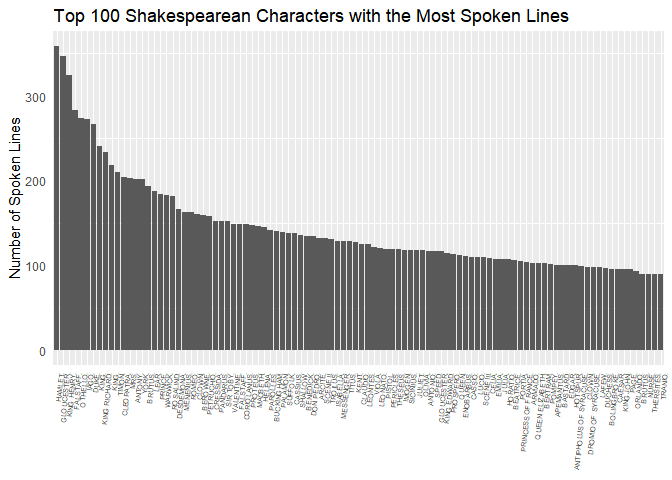
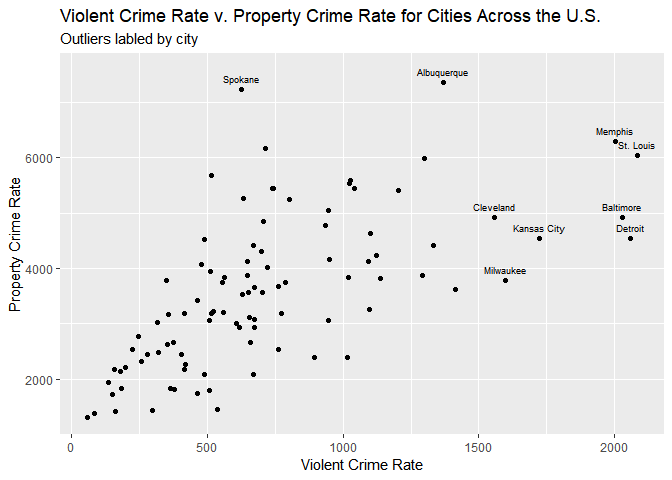
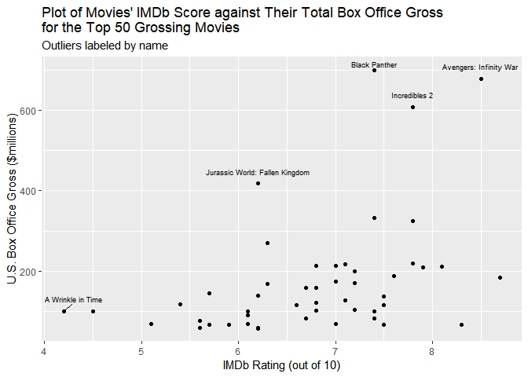

Homework 4
================
Noam Benkler
Due by 2:20 pm, Fri. 2/15

Push your knitted homework assignment (.Rmd and .md files) to GitHub by the given deadline.

Also let me know:

**Who you worked with:**

### Problem 1

The vector called `words` in `stringr` contains a corpus of 980 words used in text analysis. Use regular expressions with `stringr` to find the words that satisfy the following descriptions:

``` r
library(stringr)
library(tidyverse)
```

    ## Warning: package 'tidyverse' was built under R version 3.5.2

    ## -- Attaching packages --------------------------------------------------- tidyverse 1.2.1 --

    ## v ggplot2 3.1.0     v readr   1.2.1
    ## v tibble  1.4.2     v purrr   0.2.5
    ## v tidyr   0.8.2     v dplyr   0.7.8
    ## v ggplot2 3.1.0     v forcats 0.3.0

    ## -- Conflicts ------------------------------------------------------ tidyverse_conflicts() --
    ## x dplyr::filter() masks stats::filter()
    ## x dplyr::lag()    masks stats::lag()

``` r
library(rvest)
```

    ## Loading required package: xml2

    ## 
    ## Attaching package: 'rvest'

    ## The following object is masked from 'package:purrr':
    ## 
    ##     pluck

    ## The following object is masked from 'package:readr':
    ## 
    ##     guess_encoding

``` r
tidy.words <- data.frame(words)
tidy.words <- as_tibble(tidy.words)
```

-   begin with `b`

``` r
tidy.words %>%
  mutate(begin.b = str_detect(words, pattern = "^b.*")) %>%
  filter(begin.b == "TRUE") %>%
  select(words)
```

    ## # A tibble: 58 x 1
    ##    words  
    ##    <fct>  
    ##  1 baby   
    ##  2 back   
    ##  3 bad    
    ##  4 bag    
    ##  5 balance
    ##  6 ball   
    ##  7 bank   
    ##  8 bar    
    ##  9 base   
    ## 10 basis  
    ## # ... with 48 more rows

-   contain `q`, `x`, or `z`

``` r
tidy.words %>%
  mutate(qxz = str_detect(words, pattern = "[qxz]")) %>%
  filter(qxz == "TRUE") %>%
  select(words)
```

    ## # A tibble: 30 x 1
    ##    words   
    ##    <fct>   
    ##  1 box     
    ##  2 equal   
    ##  3 exact   
    ##  4 example 
    ##  5 except  
    ##  6 excuse  
    ##  7 exercise
    ##  8 exist   
    ##  9 expect  
    ## 10 expense 
    ## # ... with 20 more rows

-   contain `th` or `ch`

``` r
tidy.words %>%
  mutate(thch = str_detect(words, "(t| c)h")) %>%
  filter(thch == "TRUE") %>%
  select(words)
```

    ## # A tibble: 44 x 1
    ##    words    
    ##    <fct>    
    ##  1 although 
    ##  2 another  
    ##  3 authority
    ##  4 birth    
    ##  5 both     
    ##  6 bother   
    ##  7 brother  
    ##  8 clothe   
    ##  9 either   
    ## 10 father   
    ## # ... with 34 more rows

-   end with `g` but not `ng`

``` r
tidy.words %>%
  mutate(gNOng = str_detect(words, "[^ng]g$")) %>%
  filter(gNOng == "TRUE") %>%
  select(words)
```

    ## # A tibble: 4 x 1
    ##   words
    ##   <fct>
    ## 1 bag  
    ## 2 big  
    ## 3 dog  
    ## 4 leg

-   are 10 letters long

``` r
tidy.words %>%
  mutate(l.ten = str_detect(words, ".{10}")) %>%
  filter(l.ten == "TRUE") %>%
  select(words)
```

    ## # A tibble: 13 x 1
    ##    words      
    ##    <fct>      
    ##  1 appropriate
    ##  2 department 
    ##  3 difference 
    ##  4 environment
    ##  5 experience 
    ##  6 individual 
    ##  7 opportunity
    ##  8 particular 
    ##  9 photograph 
    ## 10 responsible
    ## 11 television 
    ## 12 understand 
    ## 13 university

-   have 3 or more vowels in a row

``` r
tidy.words %>%
  mutate(three.vowels = str_detect(words, "[aeiouy]{3,}")) %>%
  filter(three.vowels == "TRUE") %>%
  select(words)
```

    ## # A tibble: 10 x 1
    ##    words   
    ##    <fct>   
    ##  1 beauty  
    ##  2 eye     
    ##  3 obvious 
    ##  4 previous
    ##  5 quiet   
    ##  6 serious 
    ##  7 various 
    ##  8 year    
    ##  9 you     
    ## 10 young

-   start and end with the same letter

``` r
tidy.words %>%
  mutate(three.vowels = str_detect(words, "^([a-z])([a-z]*)\\1$")) %>%
  filter(three.vowels == "TRUE") %>%
  select(words)
```

    ## # A tibble: 36 x 1
    ##    words    
    ##    <fct>    
    ##  1 america  
    ##  2 area     
    ##  3 dad      
    ##  4 dead     
    ##  5 depend   
    ##  6 educate  
    ##  7 else     
    ##  8 encourage
    ##  9 engine   
    ## 10 europe   
    ## # ... with 26 more rows

### Problem 2

Revisit the `words` vector. What word, or words, in this vector has the highest number of vowels? What word has the highest proportion of vowels?

*Answer* In this vector, the words with the highest number of vowels all contained 5 vowels, if we include "y" as a vowel, the top 3 alphabetically are "appropriate", "associate", and "authority", otherwise "available" takes the 3rd place on the list in place of "authority" the rest are listed in the first table below.

``` r
#number of vowels
tidy.words %>%
  mutate(n.vowels = str_count(words, pattern = "[aeiouy]")) %>%
  mutate(n.vowels.noY = str_count(words, pattern = "[aeiou]")) %>%
  filter(n.vowels == "5") %>%
  arrange(desc(n.vowels.noY))
```

    ## # A tibble: 12 x 3
    ##    words       n.vowels n.vowels.noY
    ##    <fct>          <int>        <int>
    ##  1 appropriate        5            5
    ##  2 associate          5            5
    ##  3 available          5            5
    ##  4 colleague          5            5
    ##  5 encourage          5            5
    ##  6 experience         5            5
    ##  7 individual         5            5
    ##  8 television         5            5
    ##  9 authority          5            4
    ## 10 opportunity        5            4
    ## 11 university         5            4
    ## 12 yesterday          5            3

Including "y" as a vowel, the words with the highest proportion of vowels in this vector are "a", "eye", and "you", excluding "y", the word with the highest proportion of vowels in this vector is "a".

``` r
#proportion of vowels
tidy.words %>%
  mutate(n.vowels = str_count(words, pattern = "[aeiouy]")) %>%
  mutate(prop.vowels = n.vowels/str_count(words, pattern = "[a-z]"))%>%
  select(-n.vowels) %>%
  filter(prop.vowels == "1") %>%
  arrange(desc(prop.vowels))
```

    ## # A tibble: 3 x 2
    ##   words prop.vowels
    ##   <fct>       <dbl>
    ## 1 a               1
    ## 2 eye             1
    ## 3 you             1

### Problem 3

(Combining exercise 15.6 and 15.7)

Project Gutenberg contains the full text of *The Complete Works of William Shakespeare*. (<http://www.gutenberg.org/files/100/100-0.txt>)

**(a)** Use the `read_lines()` in **readr** to import the text data.

``` r
library(readr)
willi.s <- read_lines("http://www.gutenberg.org/files/100/100-0.txt")
```

**(b)** Use regular expressions to determine the number of speaking lines in *The Complete Works of William Shakespeare*. Speaking lines in Shakespeare’s plays are identified by a line that starts with two spaces, then a string of capital letters and spaces (the character’s name) followed by a period. Here, we care only about how many times a character speaks—not what they say or for how long they speak.

*Answer:* There are 32,131 speaking lines in *The Complete Works of William Shakespeare*. (After examining the text file it appears that speaking lines do not always have two spaces at the beginning of the line. Including the two spaces yeilds 1008 speaking lines which seems like too small of a number, and upon examination of characters who speak this line of code returns Scenes and Acts as well as characters. Removing the two spaces at the beginning of the string yields a much more believable number of 32,131 speaking lines and shows only characters and no scenes or acts. Moreover, upon googling the shakespearean characters with the most lines I found that the results obtained by omitting the two spaces at the beginning of the string matched exactly with the results obtained online, therefor I chose to omit the first two spaces in the code for my final answer but both counts and tables of characters are shown below.)

``` r
#create pattern two spaces, string of capital letters and spaces, period
#two spaces = \\s\\s
#string of capital letters and spaces = ([A-Z|\\s])
#period = [.]

#Sum with two spaces at the beginning
sum(str_count(willi.s, "^(\\s\\s)([A-Z|\\s]+)([.])$"))# meh
```

    ## [1] 1008

``` r
as_tibble(str_extract(willi.s, "^(\\s\\s)([A-Z|\\s]+)([.])$")) %>%
  na.omit() %>%
  group_by(value) %>%
  summarize(n.lines = n()) %>%
  top_n(100, wt = n.lines) %>%
  arrange(desc(n.lines))
```

    ## # A tibble: 62 x 2
    ##    value              n.lines
    ##    <chr>                <int>
    ##  1 "      BENEDICK."      134
    ##  2 "      DON PEDRO."     132
    ##  3 "      CLAUDIO."       124
    ##  4 "      LEONATO."       119
    ##  5 "      BEATRICE."      105
    ##  6 "      DOGBERRY."       52
    ##  7 "      HERO."           44
    ##  8 "      DON JOHN."       39
    ##  9 "      BORACHIO."       37
    ## 10 "      MARGARET."       26
    ## # ... with 52 more rows

``` r
#Sum without two spaces at the beginning it seems to me after examining the text file that there are no two spaces before a speaking line.
sum(str_count(willi.s, "(^\\s{2}[A-Z\\s]+\\.)|(^[A-Z\\s]+\\.)")) #this seems much more reasonable
```

    ## [1] 32131

``` r
as_tibble(str_extract(willi.s, "(^\\s{2}[A-Z\\s]+\\.)|(^[A-Z\\s]+\\.)")) %>%
  na.omit() %>%
  group_by(value) %>%
  summarize(n.lines = n()) %>%
  top_n(100, wt = n.lines) %>%
  arrange(desc(n.lines))
```

    ## # A tibble: 100 x 2
    ##    value             n.lines
    ##    <chr>               <int>
    ##  1 HAMLET.               358
    ##  2 "  GLOUCESTER."       346
    ##  3 "  KING HENRY."       324
    ##  4 "  FALSTAFF."         283
    ##  5 "  OTHELLO."          274
    ##  6 "  IAGO."             272
    ##  7 "  DUKE."             266
    ##  8 "  KING."             240
    ##  9 "  KING RICHARD."     234
    ## 10 KING.                 218
    ## # ... with 90 more rows

**(c)** Make a bar chart displaying the top 100 characters with the greatest number of lines. *Hint:* you may want to use either the `str extract()`.

``` r
as_tibble(str_extract(willi.s, "(^\\s{2}[A-Z\\s]+\\.)|(^[A-Z\\s]+\\.)")) %>% 
  na.omit() %>%
  group_by(value) %>%
  summarize(n.lines = n()) %>%
  top_n(100, wt = n.lines) %>%
  ggplot(aes(fct_reorder(value, n.lines, .desc = TRUE), n.lines)) +
    geom_bar(stat = "identity") +
  #coord_flip() + 
  labs(y = "Number of Spoken Lines",
       x = NULL,
       title = "Top 100 Shakespearean Characters with the Most Spoken Lines") +
  theme(axis.ticks = element_blank(),
        panel.grid.major.y = element_blank(),
        axis.text.x = element_text(angle = 85, hjust = 1, size = 5))
```



### Problem 4

Scrape the table of data found at <https://en.wikipedia.org/wiki/List_of_United_States_cities_by_crime_rate> and create a plot showing violent crime rate (total violent crime) vs. property crime rate (total property crime). Identify outlier cities by using a plotting command such as:

``` r
# ggplot(crimes, aes(x = VCrate, y = PCrate, label = City)) +
#     geom_point() +
#     geom_text(data=subset(crimes, VCrate > 1500 | PCrate > 6500), 
#               check_overlap = TRUE, size = 2.5, nudge_y = 200)
```

Hints: - after reading in the table using `html_table()`, create a data frame with just the columns you want using column numbers. Otherwise, R gets confused since it appears as if several columns all have the same column name. - then, turn `crimes` into a tibble with `as.tibble(crimes3)` and do necessary tidying: get rid of unneeded rows, parse columns into proper format, etc.

Alternatives to `geom_text()`:

If you want to try something new, check out the **ggrepel** package to label the outliers.

*Answer:* The outliers are Tucson, St. Louis, Memphis, Baltimore, Milwaukee, and Detroit

``` r
library(rvest)
library(data.table)
```

    ## 
    ## Attaching package: 'data.table'

    ## The following objects are masked from 'package:dplyr':
    ## 
    ##     between, first, last

    ## The following object is masked from 'package:purrr':
    ## 
    ##     transpose

``` r
library(ggrepel)
```

    ## Warning: package 'ggrepel' was built under R version 3.5.2

``` r
crime.tables <- read_html("https://en.wikipedia.org/wiki/List_of_United_States_cities_by_crime_rate") %>% html_nodes("table")
crime.tables 
```

    ## {xml_nodeset (2)}
    ## [1] <table class="wikitable sortable"><tbody>\n<tr>\n<th rowspan="2">Sta ...
    ## [2] <table class="nowraplinks collapsible autocollapse navbox-inner" sty ...

``` r
#appears table 1 is the one we want
crime.tables[[1]]
```

    ## {xml_node}
    ## <table class="wikitable sortable">
    ## [1] <tbody>\n<tr>\n<th rowspan="2">State\n</th>\n<th rowspan="2">City\n< ...

``` r
crimes <- html_table(crime.tables [[1]], fill = TRUE, trim = TRUE, header = TRUE)
crimes = crimes[-1,]

colnames(crimes) <- c("State", "City", "population", "VCrate", "murders","rape", "robbery", "agg.assault", "PCrate", "burglary", "larceny.theft", "gta", "arson")

crimes <- crimes [,c(1,2,4,9)] %>%
  mutate( VCrate = parse_number(VCrate),
          PCrate = parse_number(PCrate)) %>%
  as.tibble()

crimes
```

    ## # A tibble: 100 x 4
    ##    State      City       VCrate PCrate
    ##    <chr>      <chr>       <dbl>  <dbl>
    ##  1 Alabama    Mobile3     740.   5454.
    ##  2 Alaska     Anchorage  1203.   5416.
    ##  3 Arizona    Chandler    259.   2330.
    ##  4 Arizona    Gilbert      85.5  1386.
    ##  5 Arizona    Glendale    488.   4530.
    ##  6 Arizona    Mesa        416.   2172.
    ##  7 Arizona    Phoenix     761.   3671.
    ##  8 Arizona    Scottsdale  157.   2172.
    ##  9 Arizona    Tucson      802.   5252.
    ## 10 California Anaheim     355.   2630.
    ## # ... with 90 more rows

``` r
ggplot(crimes, aes(x = VCrate, y = PCrate, label = City)) +
    geom_point() +
    geom_text(data=subset(crimes, VCrate > 1500 | PCrate > 6500), 
              check_overlap = TRUE, size = 2.5, nudge_y = 200) +
  labs(x = "Violent Crime Rate",
       y = "Property Crime Rate",
       title = "Violent Crime Rate v. Property Crime Rate for Cities Across the U.S.",
       subtitle = "Outliers labled by city")
```

    ## Warning: Removed 4 rows containing missing values (geom_point).



### Problem 5

Scrape the data from IMDB's top grossing films released in 2018 at <https://www.imdb.com/search/title?year=2018&title_type=feature&sort=boxoffice_gross_us,desc>. Create a tibble that contains the title, gross, imdbscore, and metascore for the top 50 films. Then generate a scatterplot of one of the ratings vs. gross, labeling outliers as in Problem 4 with the title of the movie.

``` r
library(rvest)
library(ggrepel)
page <- read_html("https://www.imdb.com/search/title?year=2018&title_type=feature&sort=boxoffice_gross_us,desc")

titles <- page %>%
  html_nodes(".lister-item-header a") %>%
  html_text()

gross<- page %>%
  html_nodes(".ghost~ .text-muted+ span") %>%
  html_text()

imdbscores <- page %>%
  html_nodes(".ratings-bar  strong") %>%
  html_text() %>%
  as.numeric()

metascores <- page %>%
  html_nodes(".ratings-bar") %>%
  html_text() %>%
  str_remove_all("\\n") %>%
  str_remove_all("Rate this") %>%
  str_remove_all("Metascore") %>%
  str_remove_all("([1-9]*)([.])([1-9])([/])(10X)") %>%
  str_remove_all("(| __ truncated __ |)") %>%
  str_remove_all("^(| __ truncated __ |)") %>%
  str_remove("([1-9])(.)([1-9])") %>%
  str_trim() %>%
  str_remove_all("([1-9])(\\s)") %>%
  str_remove_all("10")

imdb_top_50_gross <- tibble(
  title = titles,
  gross = parse_number(gross),
  imdbscore = imdbscores,
  metascore = parse_number(metascores)
  )
imdb_top_50_gross
```

    ## # A tibble: 50 x 4
    ##    title                          gross imdbscore metascore
    ##    <chr>                          <dbl>     <dbl>     <dbl>
    ##  1 Black Panther                   700.       7.4        88
    ##  2 Avengers: Infinity War          679.       8.5        68
    ##  3 Incredibles 2                   609.       7.8        80
    ##  4 Jurassic World: Fallen Kingdom  418.       6.2        51
    ##  5 Aquaman                         332.       7.4        55
    ##  6 Deadpool 2                      325.       7.8        66
    ##  7 The Grinch                      271.       6.3        51
    ##  8 Mission: Impossible - Fallout   220.       7.8        86
    ##  9 Ant-Man and the Wasp            217.       7.1        70
    ## 10 Solo: A Star Wars Story         214.       7           7
    ## # ... with 40 more rows

``` r
ggplot(imdb_top_50_gross, aes(x = imdbscore, y = gross, label = title)) +
    geom_point() +
    geom_text_repel(data = subset(imdb_top_50_gross,
                     imdbscore > 9.3125 | imdbscore < 4.2125 | gross > 390.025),
                    size = 2.5, nudge_y = 30) +
  labs(x = "IMDb Rating (out of 10)",
       y = "U.S. Box Office Gross ($millions)",
       title = "Plot of Movies' IMDb Score against Their Total Box Office Gross \nfor the Top 50 Grossing Movies",
       subtitle = "Outliers labeled by name")
```



``` r
# summary(imdb_top_50_gross)
# gross.q3 <- 205.99
# gross.q1 <- 83.30
# gross.iqr <- gross.q3 - gross.q1
# 
# gross.q3 + (gross.iqr*1.5)
# gross.q1 - (gross.iqr*1.5)
# 
# score.q3 <- 7.400
# score.q1 <- 6.125
# score.iqr <- score.q3-score.q1
# 
# score.q3 + (score.iqr*1.5)
# score.q1 - (score.iqr*1.5)
```
