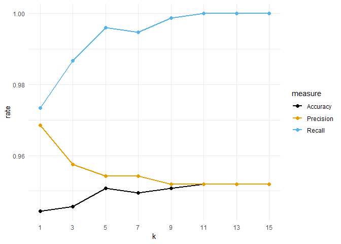
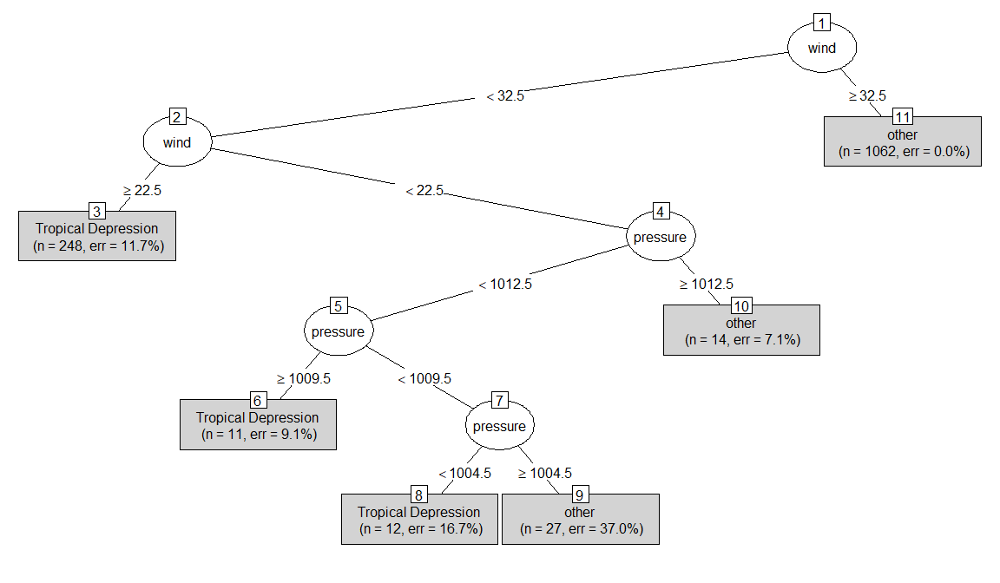
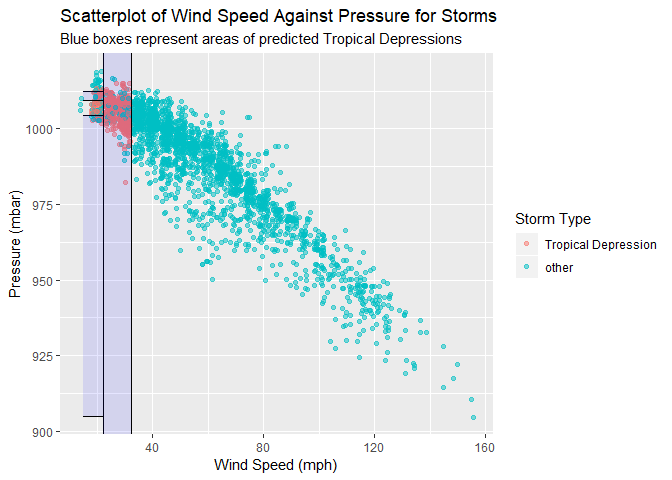
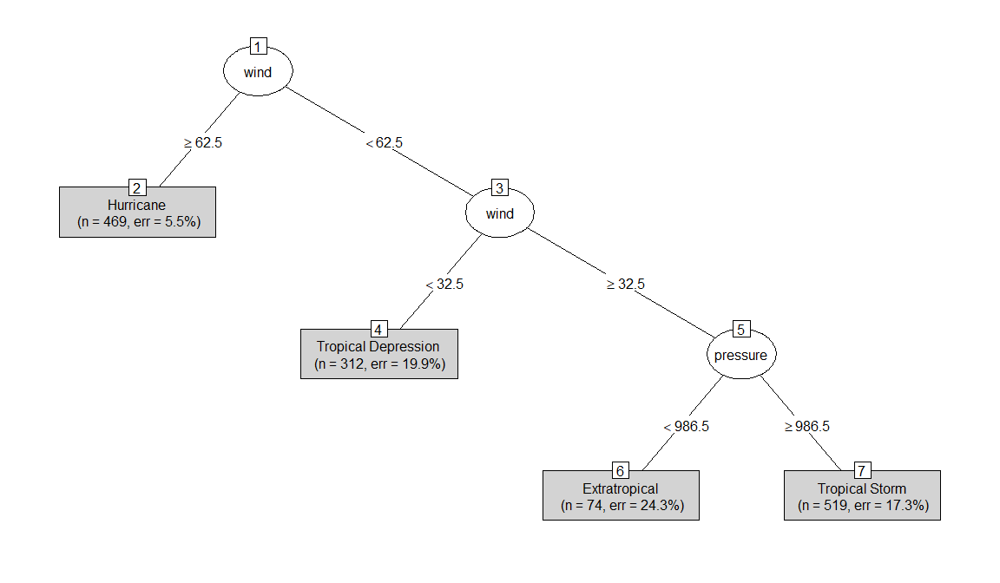
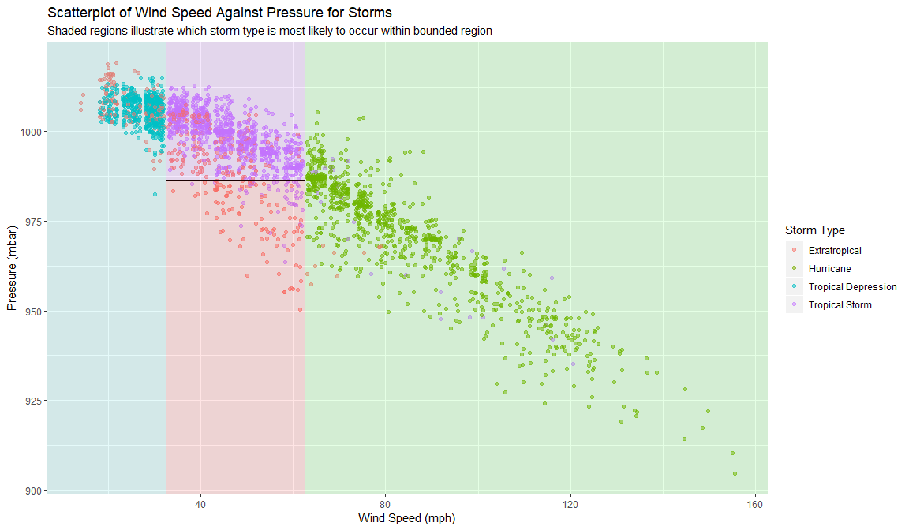

Homework 5
================
Noam Benkler
Due by 2:20 pm, Fri. 3/1

Push your knitted homework assignment (.Rmd and .md files) to GitHub by the given deadline.

Also let me know:

**Who you worked with:**

### Problem 1

Consider the `NHANES` data (from the same-named package) used in chapter 8. See the help file for this data for more info.

Now suppose you are working for Target as a data scientist and you are tasked with predicting which customers are pregnant based mainly on demographic and physical patterns observed in the publicly available NHANES data. (A real data scientist for Target would also have buying profiles!) For this problem you want to predict `PregnantNow` using the characteristics: `Age`, `Education`, `HHIncomeMid`, `MaritalStatus`, `Bmi`, and `Height`.

Preliminary steps: Recode `PregnantNow` to have two levels (yes, no) and make the `unknown` level NAs. Recode `MaritalStatus` to just be `married` or `notmarried`. Finally, create a subset of the data for females that only contains complete cases (i.e. no NAs) for the variables described above that you will use in this problem.

``` r
library(NHANES)
```

    ## Warning: package 'NHANES' was built under R version 3.5.2

``` r
nhanes <- NHANES %>% 
  mutate(
    pregnant = recode_factor(PregnantNow, No = "No", Yes = "Yes", Unknown = NA_character_), 
    married = recode_factor(MaritalStatus, Married = "married", .default="notmarried")) 
nhanes_f <- nhanes %>% 
  filter(Gender == "female")%>% 
  mutate(
    married = ifelse(married == "married", 1, 0),
    edu.some.hs = ifelse(Education == "9 - 11th Grade", 1, 0),
    edu.hs = ifelse(Education == "High School", 1, 0),
    edu.some.college = ifelse(Education == "Some College", 1, 0),
    edu.college = ifelse(Education == "College Grad", 1, 0),
    SurveyYr = as.character.factor(SurveyYr),
    SurveyYr = parse_number(SurveyYr)
  ) %>% 
  select(pregnant, Age, edu.some.hs, edu.hs, edu.some.college, BMI, HHIncomeMid, married, Height, SurveyYr) %>% 
  drop_na()
```

**a.** Split the data into a training and test set by using the 2009-10 `SurveyYr` as the training data set and the 2011-12 year as the test set. Perform any preprocessing of the training and test sets at this time.

``` r
train <- nhanes_f %>% filter(SurveyYr == "2009") %>% select(-SurveyYr)
test <- nhanes_f %>% filter(SurveyYr == "2011") %>% select(-SurveyYr)
```

**b.** Fit a 5-nearest neighbors classifier on the training set. Compute the confusion matrix, accuracy, sensitivity and specificity for the training data.

    ##      prediction
    ## truth  No Yes
    ##   No  749   4
    ##   Yes  30   8

    ## # A tibble: 1 x 4
    ##   accuracy precision sensitivity specificity
    ##      <dbl>     <dbl>       <dbl>       <dbl>
    ## 1    0.957     0.667       0.211       0.995

**c.** Compute the confusion matrix, accuracy, sensitivity and specificity for the test data using your classifier from part b.

    ##      prediction
    ## truth  No Yes
    ##   No  686   5
    ##   Yes  23   0

    ## # A tibble: 1 x 4
    ##   accuracy precision sensitivity specificity
    ##      <dbl>     <dbl>       <dbl>       <dbl>
    ## 1    0.961         0           0       0.993

**d.** The overall rate of pregnancies in your data constructed in part a should be around 5%. Dilbert, the lazy data scientist, decided simply to classify woman as "pregnant" based on this 5% rate (since, hey, it will result in about 5% of the predictions being pregnant which matches the rate in the data!). Compute the confusion matrix, accuracy, sensitivity and specificity for the test set. Make sure to explain/show your work for these calculations.

Truth: 714 women, 691 of which are not pregnant, 23 of whom are pregnant

Prediction: 36 women pregnant (0.05\*714), 678 not pregnant

If 23 out of 714 women are pregnant, and you randomly pull out 5% of women as pregnant then you will get a true positive about 0.16% of the time and a false positive about 4.8% of the time, so you will get about 1 true positive and 35 false positives.

    ## # A tibble: 1 x 4
    ##   true_pos_pct false_pos_pct true_pos false_pos
    ##          <dbl>         <dbl>    <dbl>     <dbl>
    ## 1      0.00161        0.0484     1.15      34.6

If 691 out of 714 women are pregnant, and you dismiss 95% of women as not pregnant then you will get a true negative about 91.9% of the time and a false negative about 3.1% of the time, so you will get about 656 true negatives and 22 false negatives.

    ## # A tibble: 1 x 4
    ##   true_neg_pct false_neg_pct true_neg false_neg
    ##          <dbl>         <dbl>    <dbl>     <dbl>
    ## 1        0.919        0.0306     656.      21.8

Confusion Matrix:

| Truth  | Prediction |
|--------|------------|-----|
| ------ | No         | Yes |
| No     | 656        | 35  |
| Yes    | 22         | 1   |

Accuracy: $\\frac{TP+TN}{n}$:

    ## [1] 0.9210084

Sensitivity: $\\frac{TP}{TP+FN}$:

    ## [1] 0.05

Specificity: $\\frac{TN}{TN+FP}$:

    ## [1] 0.95

### Problem 2

Consider the model you fit in problem 2. Remember that the `caret` package can help you run cross validation correctly.

**a.** Perform 5-fold cross validation to tune your KNN classifier using the training data set. Be sure to consider *k* = 1, 3, 5, 7, 9, 11, 13, 15. Report the cross-validated accuracy of the chosen model.

For a knn7 model the cross-validated accuracy is 95.2%

    ##    k  Accuracy Precision    Recall
    ## 1  1 0.9443817 0.9684846 0.9734305
    ## 2  3 0.9456075 0.9575413 0.9867020
    ## 3  5 0.9507030 0.9542404 0.9960088
    ## 4  7 0.9494452 0.9541759 0.9946843
    ## 5  9 0.9507191 0.9519132 0.9986755
    ## 6 11 0.9519769 0.9519769 1.0000000
    ## 7 13 0.9519769 0.9519769 1.0000000
    ## 8 15 0.9519769 0.9519769 1.0000000

``` r
results %>%
  ggplot(aes(x = k, y = rate, color = measure)) +
  geom_line(size = 1) +
  geom_point(size = 2) +
  theme_minimal() +
  ggthemes::scale_color_colorblind() + 
  scale_x_continuous(breaks = seq(1, 15, by = 2)) +
  theme(panel.grid.minor.x = element_blank())
```



**b.** Using the test set, calculate the test accuracy of the classifier you chose in part a. How does this accuracy compare to the cross-validated accuracy?

The test accuracy of the classifier chosen in part a is 96.4% which is higher than the cross-validated accuracy

    ## # A tibble: 1 x 1
    ##   accuracy
    ##      <dbl>
    ## 1    0.962

### Problem 3

Take a look at textbook exercise 8.5. For parts 1-2 below, we will use the response `y_td` as our response to make a classifier for **tropical depressions**:

    ## # A tibble: 4 x 2
    ##   type                    n
    ##   <chr>               <int>
    ## 1 Extratropical         412
    ## 2 Hurricane             896
    ## 3 Tropical Depression   513
    ## 4 Tropical Storm        926

    ## # A tibble: 4 x 3
    ##   type                y_td                    n
    ##   <chr>               <fct>               <int>
    ## 1 Extratropical       other                 412
    ## 2 Hurricane           other                 896
    ## 3 Tropical Depression Tropical Depression   513
    ## 4 Tropical Storm      other                 926

**a.** Create a decision tree to classify a storm as a tropical depression (or not) using `wind` and `pressure` as your predictors. Draw a tree diagram of the model and describe what wind speed and pressure characteristics can be used to identify a tropical depression. (Note: use the default control parameters for `rpart`.)

Tropical Depression occur if the wind speed is between 32.5 and 22.5mph, or if the wind speed is less than 22.5mph and the pressure is between 1012.5 and 1009.5mbar, or if the wind speed is under 22.5mph and the pressure is less than 1004.5mbar.

``` r
library(rpart)     # fit decision trees
library(partykit)  # plot nicer trees

set.seed(2252019)
train <- storms %>%
  sample_frac(0.5)

test <- storms %>%
  setdiff(train)

tree_storms <- rpart(y_td ~ wind + pressure, data = train, method = "class")
plot(as.party(tree_storms), type = "simple")
```



Tropical Depression if: 32.5 &gt; *w**i**n**d* ≥ 22.5, 22.5 &gt; *w**i**n**d* & 1012.5 &gt; *p**r**e**s**s**u**r**e* ≥ 1009.5, 22.5 &gt; *w**i**n**d* & *p**r**e**s**s**u**r**e* &lt; 1004.5

**b.** Visualize your model in part 1 in the predictor space. Your figure should look similar to either figure 8.10. (Note: use `geom_jitter` rather than `geom_point` to account for over-plotting)

``` r
storms %>% 
  ggplot(aes(x = wind, y = pressure)) + 
  geom_jitter(aes(color = y_td), alpha = 0.5) +
  geom_vline(xintercept = 32.5) +
  geom_vline(xintercept = 22.5) +
  geom_segment(x = 15, xend = 22.5, y = 1009.5, yend = 1009.5) +
  geom_segment(x = 15, xend = 22.5, y = 1012.5, yend = 1012.5) +
  geom_segment(x = 15, xend = 22.5, y = 905, yend = 905) +
  geom_segment(x = 15, xend = 22.5, y = 1004.5, yend = 1004.5) +
  annotate("rect", xmin = 15, xmax = 22.5, ymin = 905, ymax = 1004.5, fill = "blue", alpha = 0.1) +
  annotate("rect", xmin = 15, xmax = 22.5, ymin = 1009.5, ymax = 1012.5, fill = "blue", alpha = 0.1) + 
  annotate("rect", xmin = 22.5, xmax = 32.5, ymin = -Inf, ymax = Inf, fill = "blue", alpha = 0.1) +
  labs(x = "Wind Speed (mph)",
       y = "Pressure (mbar)",
       title = "Scatterplot of Wind Speed Against Pressure for Storms",
       subtitle = "Blue boxes represent areas of predicted Tropical Depressions",
       color = "Storm Type")
```



**c.** Create one decision tree to classify *all four* types of storms. Use `type` as your response and `wind` and `pressure` as your predictors. Draw a tree diagram of the model. Is it easy to distinguish between storms using these two measures? Which measure, wind speed or pressure, seems most important when classifying storm types? (Note: use the default control parameters for `rpart`.)

It is easy enough to distinguish between storms using these two measures as predictors. Error rates are grouped around 20% for most of the storm types which is non-negligable, but overall wind speed and pressure seem to be good measures for classifying storm types. It appears that wind speed is more important when classifying storm types.

``` r
all_storms <- nasaweather::storms

set.seed(2252019)
train_all <- all_storms %>%
  sample_frac(0.5)

test_all <- all_storms %>%
  setdiff(train_all)

tree_all_storms <- rpart(type ~ wind + pressure, data = train_all, method = "class")
plot(as.party(tree_all_storms), type = "simple")
```



``` r
all_storms %>% 
  ggplot(aes(x = wind, y = pressure)) + 
  geom_jitter(aes(color = type), alpha = 0.5) +
  geom_vline(xintercept = 62.5) +
  geom_vline(xintercept = 32.5) +
  geom_segment(x = 32.5, xend = 62.5, y = 986.5, yend = 986.5) +
  annotate("rect", xmin = 62.5, xmax = Inf, ymin = -Inf, ymax = Inf, fill = "green", alpha = 0.1) +
  annotate("rect", xmin = -Inf, xmax = 32.5, ymin = -Inf, ymax = Inf, fill = "cyan3", alpha = 0.1) + 
  annotate("rect", xmin = 32.5, xmax = 62.5, ymin = 986.5, ymax = Inf, fill = "purple", alpha = 0.1) +
  annotate("rect", xmin = 32.5, xmax = 62.5, ymin = -Inf, ymax = 986.5, fill = "red", alpha = 0.1) +
  labs(x = "Wind Speed (mph)",
       y = "Pressure (mbar)",
       title = "Scatterplot of Wind Speed Against Pressure for Storms",
       subtitle = "Shaded regions illustrate which storm type is most likely to occur within bounded region",
       color = "Storm Type")
```



**d.** Compute the accuracy of your model from part c. Then using language that a non-statistician/data scientist would understand, describe what accuracy measures and how you can classify these four types of storms using their wind speed and pressure characteristics.

Our model from part c is 85.7% accurate. This means that our model correctly classifies different storms based on wind speed and air pressure about 85.7% of the time. Our model classifies Hurricanes as storms that occur at wind speeds over 62mph and, Tropical depressions as storms that occur at wind speeds below 32.5 miles per hour, Extratropical Storms as storms that occur at wind speeds between 32.5mph and 62.5mph when air pressure is below 986.5mbar, and Tropical Storms as storms that occur at wind speeds between 32.5mph and 62.5mph when air pressure is at or above 986.5mbar.

    ## # A tibble: 1 x 1
    ##   accuracy
    ##      <dbl>
    ## 1    0.857
