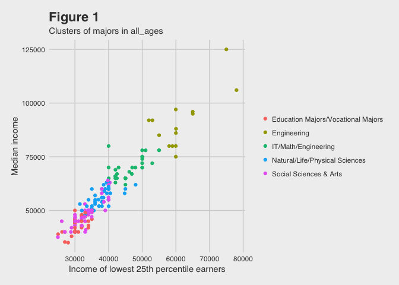
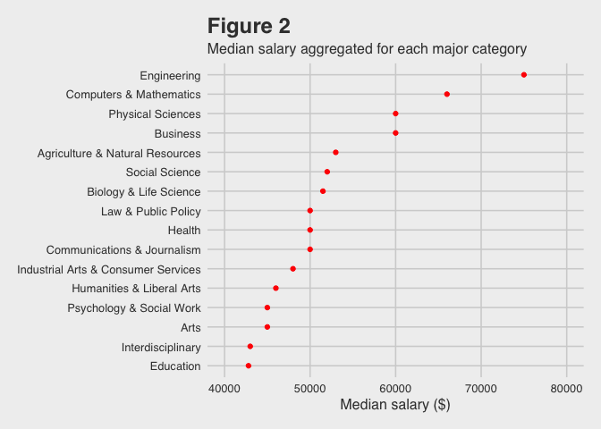
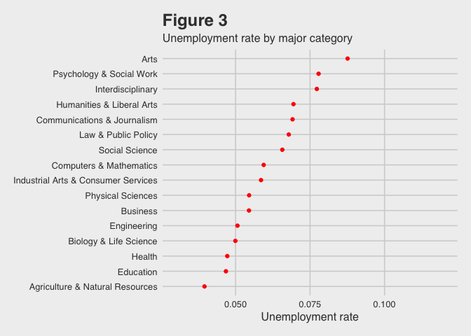

Motivation
----------

Roughly 80 percent of college students in the United States change their major at least once before graduating, according to the National Center for Education Statistics. While every college student has to choose a major of study, there are few established rules of thumb to help them make this decision. Because of this, many students first judge a major by its economic benefit. By consulting with professors, alumni, peers, and other anecdotal sources of information, students may get a rough idea of how different majors stack up financially.

A detailed look at national information on majors and finances is also very helpful. Our project aims to help students at US universities explore different potential majors based on economic statistics, which are gathered from Bachelor’s degree holders of all ages. We also wanted to examine whether it was possible to form meaningful groups between majors and economic factors using an unsupervised learning algorithm. Our project includes our report using exploratory data analysis, a tool for clustering majors based on multiple dimensions, and plot-building tools. With this, we hope to help students make better-informed decisions and explore their major options more thoroughly.

The project uses data from the U.S. Census Bureau and the American Community Survey (ACS) 2010-2012 Public Use Microdata Series. This data was modified by FiveThirtyEight, and we modified their dataset in turn for our own exploratory analysis and k-means clustering.

Exploring the dataset
---------------------

The data is split up into several data frames. FiveThirtyEight’s report focuses primarily on recent\_grads, which contains economic information on college graduates under the age of 28 for every major. This is what report writer Ben Casselman used, and it contains earnings data from people working full-time. However, these earning statistics are derived from a survey, and the sample size of respondents for each major is sometimes quite low. This creates uncertainties about the data’s overall accuracy.

We decided to focus on a more reliable dataset called all\_ages, which records a larger sample of individuals. This dataset tracks the incomes of people of all ages holding Bachelor’s degrees, along with other variables. In other words, this dataset has aggregated salary information from early-, mid-, and late-career professionals, allowing us to view the data from a broader career perspective. In addition, we applied k-means clustering to all three of FiveThirtyEight’s datasets (recent\_grads, all\_ages, and grad\_students), and found that clusters could only be meaningfully separated in the all\_ages dataset. This means that differences in income are unrelated to one’s major category for both recent college graduates and those who have postgraduate-level degrees.

In contrast, income differences for Bachelor’s degree holders actually are significant over the course of one’s career, although only the highest and lowest earning majors really pull away from the rest. This is good news for many people -- for example, an international relations major could end up making roughly the same amount as an advertising major, even if the latter may have a higher early-career salary. In other words, different professions yield varying increases in income over the course of one’s career, but this “income ceiling” is similar for many majors.

It’s important to note that we still cannot claim that certain major categories are the actual cause of higher incomes. Our dataset lacks demographic information on individuals, so we can only say that higher incomes are associated with certain majors -- lacking the ability to make a controlled comparison, it is more difficult to point out one’s chosen major as the cause of their income. That said, we can still discover some interesting trends and considerations to guide students.

Plotting the data
-----------------

We have established that some majors “catch up” to others in terms of salary over the course of a career, even if they don’t immediately pay well soon after graduation. With that in mind, let’s now explore the data in more detail to find useful statistics for students deciding on a major.

For students who most value high earnings when choosing a major, here are the five majors with the highest median income with a Bachelor’s degree:

| Major                                               | Median |
|-----------------------------------------------------|--------|
| PETROLEUM ENGINEERING                               | 125000 |
| PHARMACY PHARMACEUTICAL SCIENCES AND ADMINISTRATION | 106000 |
| NAVAL ARCHITECTURE AND MARINE ENGINEERING           | 97000  |
| METALLURGICAL ENGINEERING                           | 96000  |
| NUCLEAR ENGINEERING                                 | 95000  |

In contrast, students who are pressed for funds should note the bottom five majors for career earnings:

| Major                                     | Median |
|-------------------------------------------|--------|
| COUNSELING PSYCHOLOGY                     | 39000  |
| HUMAN SERVICES AND COMMUNITY ORGANIZATION | 38000  |
| STUDIO ARTS                               | 37600  |
| EARLY CHILDHOOD EDUCATION                 | 35300  |
| NEUROSCIENCE                              | 35000  |

A quick look at the data set reveals that the top-earning majors are primarily in engineering, which captured 16 of the top 20 highest median salary spots. In contrast, the bottom ranks are more varied but are mostly in the education field.

Despite this large salary contrast between Engineering and Education majors, a sizeable number of major categories are actually linked to similar incomes. We can visualize this with the following plot (Figure 2):

The plot confirms that engineering majors make the most, while education majors make the least: the median income for engineering majors ($75,000) is nearly twice that of graduates with degrees in education ($42,800). However, the middle six major categories have similar median incomes, which could be good news for someone trying to choose between them -- one could feel free to weigh criteria other than finances in that case.

Next, we examine the overall unemployment rate for recent graduates. This is also important because it suggests the financial security provided by various major categories. The all\_ages dataset provides a snapshot of how likely a person is to be unemployed during any given year, depending on their major. We combined full-time and part-time employment numbers in our calculations to include the “full-time” workers who don’t work year-round (such as teachers on summer break).

This reveals some interesting figures. For example, education majors have the lowest median salaries of all the major categories, but they also enjoy the second lowest unemployment rate. It appears that teaching jobs are in high demand. On the other hand, business majors have a slightly higher rate of unemployment but have a median salary roughly $17,000 more than education majors. Students would not be getting the full story if they based their major decision on either median income or the unemployment rate alone -- both statistics should be considered, along with other relevant factors. Overall though, it seems that there is not a very large practical difference in the unemployment rates among the major categories. Also, unemployment rates vary more widely between individual majors within a category. Students should use the above plots as a jumping off point for exploring further on their own.

With all that said, it can still be daunting for a student early in their college career to start thinking about choosing a major. With all the economic variables involved, manually weighing major against each other is a difficult task. We created a clustering tool for users to visualize which majors are most similar to each other based on economic data. This can suggest majors a student might be interested in during the early stages of their decision process. You can explore this clustering tool and create your own clusters and plots in the other tabs.
