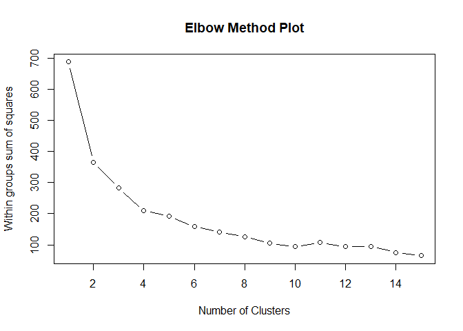
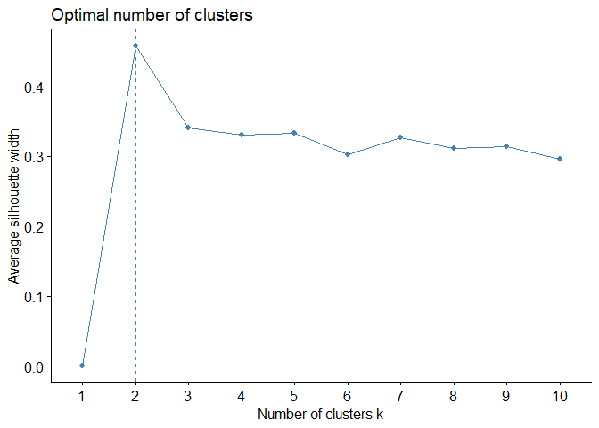
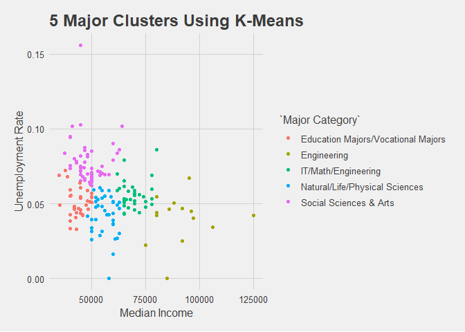

Clustering
================
3/15/2019

Introduction
------------

Given the large number of majors contained in this dataset, learning more about the economic benefits of specific majors, or major categories may be time-consuming. To make this process easier, we have created a tool that uses k-means clustering to group certain types of majors in broader categories based on unemployment rates and 25th, median, and 75th percentile income of a major's graduates. We chose an unsupervised learning method for this problem because we do not have a dataset that has majors grouped by the parameters we are interested in exploring.

Although the initial dataset contained a column that categorised each major into a larger major group, we found that these categories were not related to the earning potential of that major. So, we created our own labels to group majors based on unemployment rates and 25th, median, and 75th percentile income of a major's graduates. The data we used for this analysis contains information on income and employment rates for various majors for graduates of all ages, and not just recent grads.

Methodology
-----------

To ensure we were using only our desired variables, we created a subset of our data using just the selected columns, and used this dataframe in determining our clusters. The first step was the standardize all the data we have to ensure minimum variance in distributions. Next, we determined the appropriate number of categories, or centers, our k-means analysis should use given the data we had only contained 173 observations. To do this, we used two methods:

#### The Elbow Method:

This method helps us determine the optimum number o clusters to create by calculating the sum of squared errors (SSE) for each intended value of k. Once the SSE's are plotted, we can visually interpret which values of k give us a lower SSE. The appropriate number of clusters to use is the point at which our distribution appears to have a "bend like an elbow joint", hence the name of method. However, the visual generated by our data does not appear to have a clear bending point, as seen below, making it hard to distinguish the appropriate number of centers for our analysis. Based on this graph, it may be worth exploring values of k between 4 and 6.

#### Average Silhouette Method:

This method helps us determine the optimum number of clusters required to ensure objects lie neatly with their respective clusters, i.e. the highest quality of each cluster. According to this plot, the optimum number of centers for our analysis on this dataset is 2. However, 2 clusters does not provide students with nearly enough detail to filter the majors presented in our data.

Using the approximate distributions of the two plots above, and our own intuition of what is appropriate given our goals, we decided to try using 3-7 centers to cluster our data. Ultimately, our analysis demonstrated that 5 centers yielded the best results. With 5 centers, all majors in each cluster appeared to have a lot in common with one another in terms of field of study, and professional and/or academic focus.

Results
-------

Once we had our clusters, we assigned each group an appropriate label. The five clusters are:

1.  Education Majors and Vocational Majors
2.  Natural/Life/Physical Sciences
3.  Social Sciences and Arts
4.  Engineering
5.  IT/Math/Engineering

Given that our clusters also take into account unemployment rate, it was interesting to see that certain types of engineering were a part of their own group. It is also worth noting that many graduates with an education in a business fall in various clusters, depending on the business function they perform. Marketing majors and Operations & Supply Chain Management majors for instance, fall into completely different clusters, making it tricky to group business majors.

Addtionally, when we attempted to perform a similar clustering analysis on our other datasets that contain information on only recent grads (&gt;28 years of age) and on only graduate students (above 25 years of age), we found no discernable similiarities between the majors in each of the 5 resulting clusters. This analysis perhaps indicates that unemployment rates and income are not significantly impacted by major in most entry level jobs, but over longer periods of time. However, it is also worth noting that despite this, engineering majors did appear to dominate the clusters with higher salary ranges even in our analysis of these datasets.
