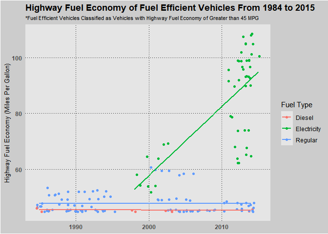

Team HW\#1
================
Noam Benkler, Daniel Matsuda
Math 285, Winter 2019

The global automobile market has made several technological improvements to their products over the years. One example is the sharp increase in fuel efficiency. Our scatter plot compares vehicles with a highway mileage of over 45 miles per gallon from 1984 to 2015. We found that the most efficient cars in the late 2010’s are more than twice as efficient as the most efficient car from 1990. We also found that there is a relationship between this efficiency increase and the use of electricity as a fuel source, rather than petroleum or diesel.

Our plot shows a clear difference between efficient cars that use petroleum or diesel versus electricity. In the petroleum and diesel-fueled categories, no cars were made after 2006 that improved on efficiency. This implies an upper limit for such cars that manufacturers have been unable to break through. On the other hand, manufacturers have managed to continually improve the efficiency of vehicles in the electric category. This is helpful information for a variety of people, such as investors, environmentally-conscious consumers, and government regulators interested in fuel efficiency.
