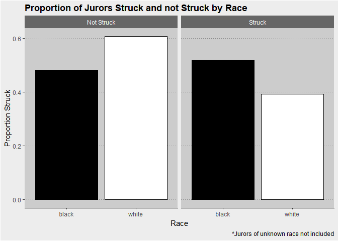
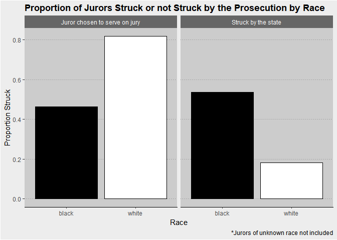
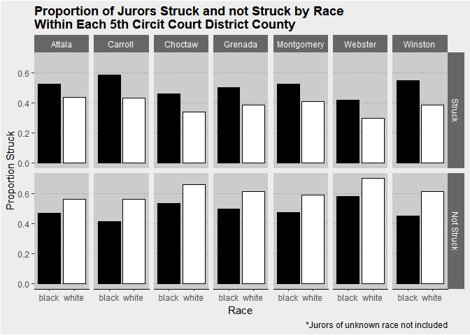
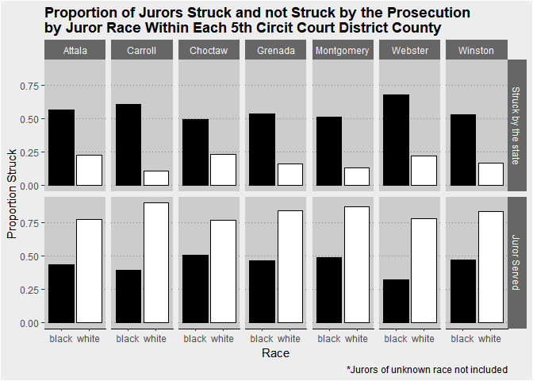
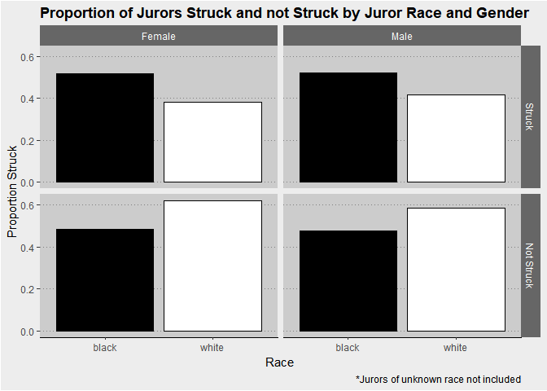
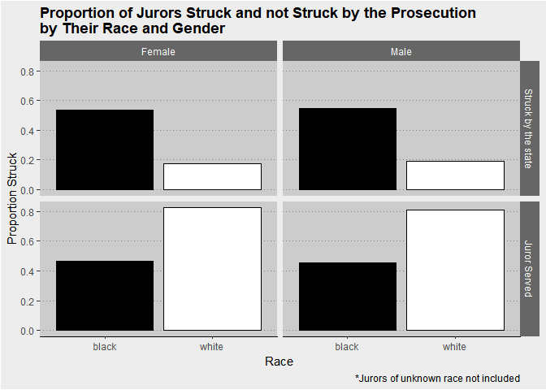

The Role of Race in Jury Selection.
================
Noam Benkler, Kitty Miao
Math 285, Winter 2019

Introduction
------------

In 1986, the Supreme Court ruled in *Batson v. Kenucky* that banned prosecutors from using race as a reson to impose peremptory strikes against African-American (referred as Black in graphs) potential jurors. However, despite the effort made by the Supreme Court, racial discrimination still exists in the jury selection process, and in ways prosecutors treat jurors of different races.

Collected by journalists working on the APM Reports podcast "In the Dark", the data set from 305 trials from 1992 to 2017 was used to analyze peremptory strike decisions in the Fifth Circuit Court District of Mississippi in this report. We found that African-American potential jurors were disproportionately struck by Missisipi courts, regardless genders of the jurors and court locations.

Methodology
-----------

We analyzed the role of race in juror selection decisions by examining the proportion of strikes within each race group. In other words, we were concerned about relative juror selection results, instead of exact numbers of jurors selected on jury. More specifically, we first presented and discussed the results of race and selection in Mississippi in general, and then investigated the regional and gender dependence of these results. All data sets we used were from APM Reports, and we did not acquire additional data.

#### Data manipulation

We first joined the `trials` and `jurors` data sets from the APM Reports in order to get information about each trial involved in the study and each juror involved in each trial. We then filtered the data set to only look at trial identification number, the county in which the trial took place, the race and gender of the jurors, and whether the juror was struck from the case and by which party. In order to get a better sense of relative proportions of jurors struck we collapsed the `struck_by` factor into two categories, whether the juror was struck from the case or whether they were not. Then, we filtered the data to only look at black and white jurors as we were only interested in the relative proportions of those two races. Finally, as the study was looking at prosecutors’ use of race in jury selection, we decided to compare proportions of total jurors struck to proportions of jurors struck by the state for each base comparison we executed.

Results
-------

The APM Reports data set contained information of 14874 potential jurors. We analyzed juror selection results by the prosectuion, and by the court system as a whole within Missisipi generally, within individual counties within the 5th circit court district, and accounting for the role of gender.

#### Juror selection results and race in Missisipi

APM reports gathered race data on 14874 potential jurors. Of those 14874 jurors, 51.9% of the black jurors were struck, nearly 1.3 times as many as white jurors (39.3%). This means that there is a overall trend that the courts preferred not to have black people serving in the court. In particular, when we closely examined the number of jurors struck by state this disparity became more striking. Our data revealed the prosecution struck 53.7% of black potential jurors, which is nearly 3 times higher than the 18.2% of white potential jurors the state chose to strike.

#### Juror selection results and race in individual counties

Motivated to investigate further into the juror selection disparities due to race, we analyzed the variations of proportions of potential jurors who got struck in different counties. We found that, in every single county, jurors of african american decent were more likely to be struck from the case than white jurors. We found the preference for white jurors over black jurors was weakest in Webster, where only 41.8% black jurors were struck.

When we filtered the data to solely focus on the prosecution, however, the extent of racial bias in jury selection was made eminently clear. Even in Choctaw county, which had the smallesed racial gap in strike proportions by the state, the percent of black jurors struck (49.5%) was over twice as high as the percent of white jurors struck (23.4%). In Carroll, the county with the highest racial gap, the percent of black jurors struck by the state (60.8%) was just under six times higher than the percent of white jurors struck by the state (10.5%).

#### Juror selection results, race and gender

In addition to just looking at race, we wanted to see whether gender played a role in the jury selection process. From the data of 14874 potential jurors, we found some overall preference for female over male jurors. While 52.2% black males excluded from serving on jury, approximately 1% higher than their female counterparts (51.6%). Similarly, 41.4% of the white males were struck by the court, yet only 38.1% of the white females were struck.

However, gender did not play a significant role in minimizing racial biases. Still across the board, it was clear that black potential jurors were struck at a much higher proportion than white potential jurors, reguardless of race. While the percent of male and female black jurors struck by the state remained relatively similar (54.8% and 53.7% respectively), the percent of male and female jurors struck by the state dropped significantly(19.2% and 17.6% respectively), compared to the percent struck total, and were less than half the as high as the percents of male and female black jurors struck.

Conclusion
----------

Over the course of this paper we attempted to determine whether prosecutors’ use of race in jury selection in the Flowers case was part of a larger pattern in the Fifth Circuit Court District of Mississippi during Evans’ tenure. We believe it is. No matter if we break down the data by race neutral factors, our plots show wide-spread racial disparities in strike rates. Moreover, we have found that the prosecution tend to have exercised strikes against black jurors at a much higher rate than white jurors, and at a much higher ratio than the total strikerate in the 5th circut court district. It is clear that the use of race in jury selection in the Flowers case was part of a larger pattern in the Fifth Circuit Court District of Mississippi during Evans’ tenure.
